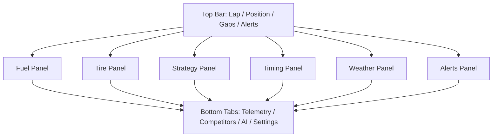
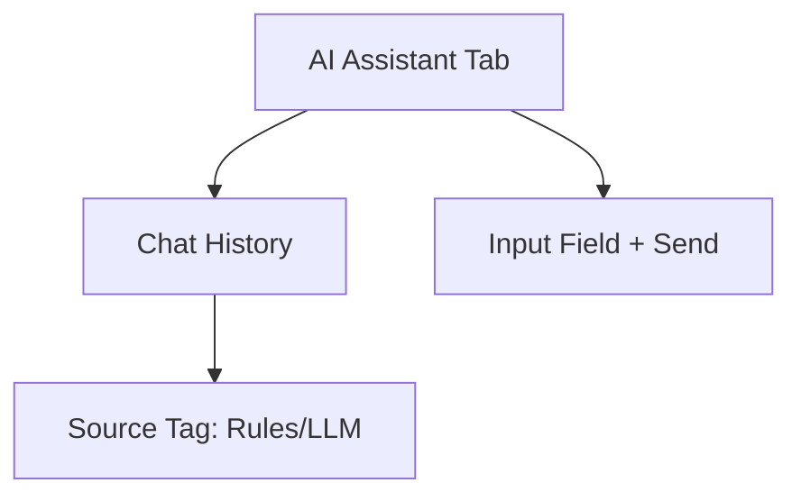
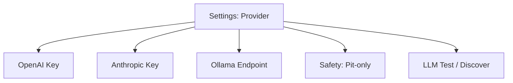

# PitWall LMU UI/UX Specification (Avalonia)

**Purpose:** Master UI/UX spec for the PitWall LMU desktop app. This document guides all UI work, from layout to interaction behavior and performance targets.

**Target Stack:** Avalonia (desktop)

**Primary Use Case:** A professional pit wall display running on a second monitor during live racing. The UI must be instantly legible, low-latency, and resilient under stress.

---

## 1) Operating Constraints

- Telemetry ingest: 100 Hz (backend), UI refresh: 10 Hz (front end)
- UI frame target: 60 FPS (16.6 ms budget)
- Updates must not cause layout shift or jitter
- Critical alerts always visible, no auto-hide
- Data should be readable at a glance within 1 second

---

## 2) Visual System

### 2.1 Color Palette (Pit Wall)

- Background: #0A0A0A
- Panel: #1A1A1A
- Border: #2A2A2A
- Text primary: #FFFFFF
- Text secondary: #888888

**Status Colors**
- Success: #00FF41
- Warning: #FFB800
- Critical: #FF0033
- Info: #00D9FF
- Neutral: #555555

**Data Colors**
- Speed: #00D9FF
- Fuel: #FFB800
- Tires: #00FF41 (gradient to red on degradation)
- Battery: #9D4EDD

### 2.2 Typography

- Data values: Monospace (e.g., IBM Plex Mono / Roboto Mono)
- Labels: Sans-serif (e.g., Inter or system default if needed)
- Numbers right-aligned
- Minimum size for critical values: 16 px

### 2.3 Spacing and Grid

- Use an 8/16/24 px spacing grid
- Panels use consistent padding (16 px)
- Gutter between panels: 16 px

---

## 3) Information Hierarchy

### 3.1 Critical (Always Visible, Large)

- Lap current/total
- Position and class position
- Fuel laps remaining
- Tire wear (all 4 corners)
- Gap to ahead/behind
- Critical alerts

### 3.2 Important (Secondary)

- Last lap vs best lap
- Tire temperatures
- Fuel consumption rate
- Predicted pit lap
- Weather + track temp

### 3.3 Contextual (Tabs / Collapsible)

- Sector deltas
- Competitor list
- Historical lap trends
- Telemetry graphs
- AI assistant conversation history

---

## 4) Main Screen Layout

### 4.1 Structural Regions

- **Top Bar:** Session summary and critical alerts
- **Main Grid:** Fuel, Tires, Strategy, Timing, Weather
- **Bottom Tabs:** Telemetry graphs, competitors, AI assistant

### 4.2 ASCII Wireframe (Primary Pit Wall View)

```
┌──────────────────────────────────────────────────────────────────────────────┐
│ LAP 15/30 │ P3 │ GAP +2.3s │ ⚠ PIT WINDOW: LAP 18 │ FUEL 3.2 LAPS │ CRIT?   │
├──────────────────────────────────────────────────────────────────────────────┤
│                                                                              │
│  FUEL                 TIRES                  STRATEGY              TIMING   │
│  ┌──────────────┐     ┌────────────────┐     ┌────────────────┐    ┌──────┐  │
│  │ 45.2 L        │     │ FL 92C 68%     │     │ NEXT PIT: L18  │    │ LAST │  │
│  │ 14.2 LAPS     │     │ FR 95C 70%     │     │ FUEL+TIRES     │    │ 3:42 │  │
│  │ █████░░░░░    │     │ RL 88C 65%     │     │ CONF 0.85      │    │ BEST │  │
│  └──────────────┘     │ RR 91C 67%     │     └────────────────┘    │ 3:40 │  │
│                       └────────────────┘                           └──────┘  │
│                                                                              │
│  WEATHER                                ALERTS                               │
│  ┌──────────────────────────┐           ┌──────────────────────────────────┐ │
│  │ CLEAR 32C TRACK           │           │ NONE                             │ │
│  │ WIND 5 KPH                │           │                                  │ │
│  └──────────────────────────┘           └──────────────────────────────────┘ │
│                                                                              │
├──────────────────────────────────────────────────────────────────────────────┤
│ [ TELEMETRY ] [ COMPETITORS ] [ AI ASSISTANT ] [ SETTINGS ]                  │
└──────────────────────────────────────────────────────────────────────────────┘
```

---

## 5) Component Catalog

### 5.1 Fuel Panel

- **Primary:** Fuel liters + fuel laps remaining
- **Secondary:** Burn rate (L/lap)
- **Visual:** Horizontal bar with thresholds
  - Green > 4 laps
  - Amber 2-4 laps
  - Red < 2 laps

### 5.2 Tire Panel (4 Corner Grid)

- Each corner shows temp + wear
- Wear indicator color gradient green -> red
- Optional small sparkline for last 10s temp trend

### 5.3 Strategy Card

- Next pit lap
- Recommended action (Fuel + Tires / Fuel only / Tires only)
- Confidence score
- Optional pit window range

### 5.4 Timing Block

- Last lap time, best lap time
- Delta in ms
- Last lap validity indicator

### 5.5 Weather Card

- Track temp, air temp, condition
- Rain intensity if available

### 5.6 Alerts Panel

- Alerts sorted by priority
- Critical alert banners override panel with full-width red
- Each alert includes action and reason

### 5.7 AI Assistant Panel

- Minimal chat list
- Input box + mic icon (future)
- Each response tagged with source (Rules / LLM)

---

## 6) Data Mapping (API/WS)

### 6.1 Strategy and Telemetry

- **/ws/state** (WebSocket): Real-time telemetry feed
  - Fuel, speed, tire temps, brake/throttle, etc.
- **/api/recommend** (REST): Strategy recommendation + confidence

### 6.2 AI Assistant

- **/agent/query** (REST): Natural language responses
- **/agent/health** (REST): LLM availability
- **/agent/llm/test** (REST): LLM connection test
- **/agent/llm/discover** (REST): LAN discovery

### 6.3 Configuration

- **/agent/config** (GET/PUT): LLM provider selection, keys, safety flags

---

## 7) Interaction Flows

### 7.1 Pit Call Flow

1. Strategy card highlights pit window
2. User presses "Confirm Pit" (future)
3. Alert acknowledged in UI

### 7.2 AI Query Flow

1. User opens AI tab
2. Enters query
3. Rules engine responds or LLM fallback
4. Response tagged with source

### 7.3 Alert Acknowledgment

- Critical alerts require manual dismissal
- Non-critical alerts auto-expire after 10s

---

## 8) Accessibility

- Color is not the only signal (icons + labels)
- Color-blind safe indicators (patterns/icons)
- Keyboard shortcuts for major panels
- High-contrast mode toggle

---

## 9) Performance Guidelines

- UI updates at 10 Hz even if data arrives at 100 Hz
- Use throttling or batching for charts
- No layout reflow on every update
- Animated transitions limited to 200-300 ms

---

## 10) Wireframes (Mermaid)

### 10.1 Main Screen



### 10.2 AI Assistant Panel



### 10.3 Config View



---

## 11) UI Checklist (Definition of Done)

- All critical data visible at all times
- Alerts system implemented with priority
- AI panel functional and responsive
- Works at 1920x1080 and 2560x1440
- 60 FPS during telemetry updates
- Keyboard shortcuts enabled
- High contrast mode available

---

## 12) Next Steps (Implementation)

- Create Avalonia shell project
- Build layout structure first
- Implement data bindings from API/WS
- Build component library (Fuel/Tires/Strategy)
- Add alert system
- Add AI panel
- Add settings view
